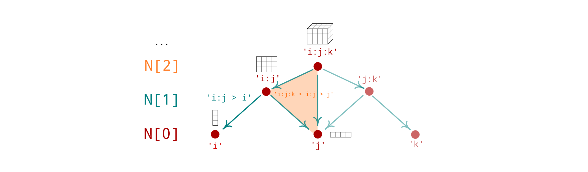
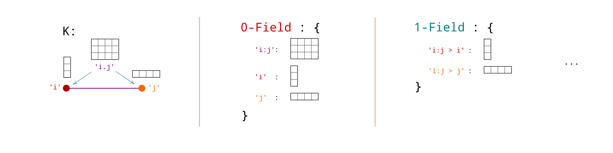

# Topos

[hypergraph]: https://en.wikipedia.org/wiki/Hypergraph
[nerve]: https://en.wikipedia.org/wiki/Nerve_(category_theory)
[divergence]: https://en.wikipedia.org/wiki/Divergence
[sheaf]:https://en.wikipedia.org/wiki/Sheaf_(mathematics)

This library implements topological and statistical structures 
described in [[2]](#ref2), initially motivated by the
study of message-passing algorithms such as generalized belief propagation (GBP [[1](#ref1), [3](#ref3)]).

Local statistics of random variables <span>$(X_i)_{i \in \Omega}$</span>
can be described over a covering or hypergraph $G \subseteq \mathcal{P}(\Omega)$ of the set of vertices $\Omega$.
A $k$-_region_ $a \subseteq \Omega$ is a collection $a = \\{i_0, \dots, i_d \\}$ 
of $k+1$ vertices. Graphs are a particular case having only degree $k \leq 1$ regions. 

Atomic and region-wise degrees of freedom can usually be described by a 
free [sheaf] $E : G^{op} \to \mathrm{Set}$ satisfying $E_a = \prod_{i \in a} E_i$.
Functoriality then consists of restriction maps $\pi^{a \to b} : E_a \to E_b$ for every
partial order relation $b \subseteq a$. From this data one can also define functors 
$\mathbb{R}^E : G \to \mathrm{Alg}$ and $\mathbb{R}^{E * } : G^{op} \to \mathrm{Vect}$ 
of local _observables_ and _densities_ respectively. The pullbacks of observables $\pi^{a \to b\:* } : \mathbb{R}^{E_b} \to \mathbb{R}^{E_a}$ 
are cylindrical extensions while the pushforwards of densities
<span>$\pi^{a \to b}_* : \mathbb{R}^{E_a *} \to \mathbb{R}^{E_b *}$ </span> 
consist of partial integrations.
In the GBP setting, 
a dual pair of differential operators $d$ and $\delta = d^{ * }$ is moreover introduced. 
Generalizing the usual discrete gradient and divergence operators, 
they lead to diffusion equations improving stability and convergence of GBP.

Sheaves $F : G^{op} \to \mathrm{Set}$ that are not free can be obtained by natural transformation
of a free sheaf $E$. 
This occurs for instance in molecular applications, 
when defining equivariant message-passing schemes or invariant local functionals. 

The purpose of this library is to provide efficient data structures for 
generic sheaves $F : G^{op} \to \mathrm{Set}$, where $G$ can be any (directed) (multi-)graph.
Domain classes such as `MultiGraph, Graph, Quiver, Complex, Nerve, ...` are for instance distinguished, 
with specific operators implemented depending on their structure. 

### References 
<span id="ref3"></span>
[1] : Yedidia, Freeman and Weiss, 2000 - _Generalized Belief Propagation_,
NeurIPS 2000. [full text][YFW00]

<span id="ref2"></span>
[2] : Peltre, 2020, _Message-Passing Algorithms and Homology_, 
PhD thesis. [arXiv:2009.11631][phd]

<span id="ref1"></span>
[3] : Peltre, 2021, _Belief Propagation as Diffusion_.
GSI'21 proceedings. [arXiv:2107.12230][gsi21]


[gsi21]: https://arxiv.org/abs/2107.12230
[phd]:   https://arxiv.org/abs/2009.11631
[YFW00]: https://https://proceedings.neurips.cc/paper/1832-generalized-belief-propagation.pdf
[not_table]: https://arxiv.org/pdf/2009.11631#page=4
[alg_table]: https://arxiv.org/pdf/2107.12230#page=7


## Installation 

Run `pip install git+https://github.com/opeltre/topos`

Or clone the repository locally before installing: 
```sh
$ git clone https://github.com/opeltre/topos
$ cd topos
$ pip install .
```


## Usage  (outdated)

_The library is being refactored to provide generic topological and algebraic tools
for discrete mathematics and statistics._

_The README should be split in (1) an introduction to the library and (2) specific notebook 
examples for applications e.g. BP or molecules._

### Systems 



System instances describe collections of variables (vertices) 
along with their allowed joint measurements (cells or regions). 
Each variable is assumed binary (2 states) by default.

A system can for example be a graph (all regions are pairs) 
or a higher dimensional instance, called a [hypergraph][hypergraph]. 
For generalized belief propagation (GBP) to run well,
the underlying hypergraph should be closed under intersection. 

```py
from topos import System
K = System.closure(("i:j:k", "j:k:l", "i:k:l"))
```

When a `System` instance is created, all inclusion relations 
are computed to yield the [nerve][nerve] of the hypergraph. 

A collection of topological and combinatorial operators 
are also computed: they act on Field instances. 

### Fields 



A 0-Field `u` is a collection of tensors indexed over regions 
such that `u[a]` is joint observable on variables in `a`.

```py
>>> u = K.zeros(0) 
>>> u["j:k"]
torch.tensor([[.0, .0],
              [.0, .0]])
```

A 1-Field `phi` is a collection of tensors indexed by 1-chains 
such that `phi[a > b]` is a function on the state of variables in `b`. 

```py
>>> phi = K.randn(1)
>>> phi["j:k > k"]
torch.tensor([-0.5114, 0.5331])
```

### Operators  

There is a collection of natural operators acting on such
statistical systems, revealing a rich interplay with topology 
and combinatorics. 

These include (implemented):
- (+1)-graded differential operator `K.d`
- (-1)-graded codifferential operator `K.delta`
- graded zeta transform `K.zeta` 
- graded Möbius transform `K.mu` inverting `K.zeta`
- Gibbs state map `K.gibbs` mapping observables to local probabilities
- the effective energy gradient `K.Deff` from 0-fields to 1-fields
- its tangent map `K.nabla(p)` at a consistent belief `p`. 

See [[1]](#ref1)  and [[2]](#ref2) for a better description of 
these operators and their role in the design of
belief propagation algorithms. 

(In particular, have a look at [algorithms][alg_table]
and [notation table][not_table])

## Example: belief network on graphs

See [example.py](example.py)

```py
>>> K = System(("i:j", "j:k"))

>>> u = K.randn(0)
>>> u
0 Field {

(i:j) ::       [[-1.6016,  0.6941],
                [-0.2367, -0.1504]],

(j:k) ::       [[ 0.3672, -0.0543],
                [ 0.7570, -0.0231]],

(j) ::       [0.5114, 0.5331],

}

>>> K.d
1 Linear d

>>> K.d(u)
1 Field {

(i:j) > (j) ::       [ 2.3497, -0.0106],

(j:k) > (j) ::       [ 0.1985, -0.2008],

}
``` 

