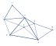

[hypergraph]: https://en.wikipedia.org/wiki/Hypergraph
[nerve]: https://en.wikipedia.org/wiki/Nerve_(category_theory)
[divergence]: https://en.wikipedia.org/wiki/Divergence
[sheaf]:https://en.wikipedia.org/wiki/Sheaf_(mathematics)
[dependent product]:https://en.wikipedia.org/wiki/Dependent_type#Pi_type
[dependent sum]:https://en.wikipedia.org/wiki/Dependent_type#Sigma_type

# Topos

_The library is being refactored to provide generic topological and algebraic tools
for discrete mathematics and statistics._

_This README provides a quick introduction to using the library. For motivations and examples of application, see:_
1. [Graph convolutional networks via discrete Hodge theory](I_graph_networks.md)
2. [Generalized Boltzmann machines and belief networks](I_belief_networks.md)
3. [Equivariant message-passing for molecules and materials](II_equivariant_mpnn.md)

## Installation 

Run `pip install git+https://github.com/opeltre/topos`

Or clone the repository locally before installing: 
```sh
$ git clone https://github.com/opeltre/topos
$ cd topos
$ pip install .
```

You should be able to run tests with: 
```
$ cd test && python -m unittest
```

# Usage 

## Introduction

_Github doesn't render this section's md + tex properly... Find a better way to document_

The purpose of this library is to provide efficient data structures for 
[sheaves](sheaf) $F : \mathcal{P}(\Omega)^{op} \to \mathrm{Set}$, where
$\Omega = \{ 0, \dots, N_{\rm vtx} - 1 \}$ is a possibly large set of indices.

<p>
Canonical examples are given by random variables $X = (X_i)_{i \in \Omega}$ such that each $X_i$
is valued in a set $F_i$, as for every $a \subseteq \Omega$ 
one may observe a restricted joint variable $X_a$ 
valued in $F_a = \prod_{i \in \Omega} F_i$.
The sheaf $F$ is then called a <a href='topos/base/functor.py'>free functor</a> over $\mathcal{P}(\Omega)^{op}$.
On top of such a sheaf lie algebras of local observables defined by $\mathbb{R}^F : {\cal P}(\Omega) \to \mathbf{Alg}_c$.
</p>

Because integration is not tractable on the global configuration space $F_\Omega$ for large $N_{\rm vtx}$, it is preferable to work with local 
functionals with respect to a covering $K \subseteq {\cal P}(\Omega)$. More precisely, when $K$ is graded e.g. by the dimension ${\rm dim}(a) = 1 + {\rm card}(a)$, we may define an algebra of _degree-n local fields on_ $K$:

$$ {\tt Field}(K_n, F)  = \prod_{a \in K_n} \mathbb{R}^{F_a}$$

This [dependent product] type is realized by large 1D torch vectors.
Specific operators can be cached as sparse matrices 
depending on the
topological structure of $K$, which could be any (directed) 
(multi)-hypergraph. This lets one design efficient parallel computations on the GPU with great flexibility on the base space $K$ and the functor $F$. 
Domain classes such as `MultiGraph, Graph, Quiver, Complex, Nerve, ...` are for instance distinguished. 

Note than when $K$ is a simple 1-graph, 0-fields are vectors indexed 
by vertices and 1-fields are vectors indexed by edges. The functorial data defines feature spaces $F_i$ above each vertex and $F_{ij}$ above each edge,
together with restriction maps $F_{ij} \to F_i$ and $F_{ij} \to F_j$. 
The pullback $\mathbb{R}^{F_i}\to \mathbb{R}^{F_{ij}}$ embeds any vertex observable to an edge observable that does not depend on the state of the other vertex. The algebra structure is given by pointwise addition and multiplication of real functions. The graph differential, codifferential and laplacian operators are inherited from the 
`Complex` class (as a 1-graph in the usual sense is a 1-simplicial complex, i.e. if an edge $ij$ is in $K$ then both vertices $i$ and $j$ are in $K$).
Powers of the laplacian yield the convolution kernels of graph convolutional networks. 

### References 
<span id="ref3"></span>
[1] : Yedidia, Freeman and Weiss, 2000 - _Generalized Belief Propagation_,
NeurIPS 2000. [full text][YFW00]

<span id="ref2"></span>
[2] : Peltre, 2020, _Message-Passing Algorithms and Homology_, 
PhD thesis. [arXiv:2009.11631][phd]

<span id="ref1"></span>
[3] : Peltre, 2021, _Belief Propagation as Diffusion_.
GSI'21 proceedings. [arXiv:2107.12230][gsi21]


[gsi21]: https://arxiv.org/abs/2107.12230
[phd]:   https://arxiv.org/abs/2009.11631
[YFW00]: https://https://proceedings.neurips.cc/paper/1832-generalized-belief-propagation.pdf
[not_table]: https://arxiv.org/pdf/2009.11631#page=4
[alg_table]: https://arxiv.org/pdf/2107.12230#page=7


# Usage

## Fields 

Index ranges are represented by topos instances subclassing the `Domain` base class. The `Field` functor then maps any domain `D` to a tensor type 
`Field(D)` wrapping 1D-torch vectors of length `D.size`:
```py
from topos import Domain, Field
#--- Domain with keys [0, ..., n-1]
D = Domain(list(range(n)))
#--- Tensor type of shape [n] ---
FD = Field(D)  
#--- Fields wrap torch tensors ---
x  = FD(torch.zeros([n]))
True == isinstance(x.data, torch.Tensor)
```
A field instance `x = D.field(data)` can be created from any numerical data of the appropriate size. Note that `D` also provides with common fields constructors such as `D.zeros(), D.ones(), D.randn()`, etc.

## Sheaves

The `Sheaf` class is a generic base class representing finite 
domains defined as a [dependent sum] type:

$$ F(K) = \bigsqcup_{a \in K} F_a $$

i.e. points of $F(K)$ are key-value pairs
$(a, x_a)$ for $a$ in a set of keys $K$ and $x_a$ in the finite set $F_a$.
A trivial sheaf, i.e. with a point above each key, is constructed by default. No categorical structure is assumed on $K$ so that one may create a non-trivial `Sheaf` instance by supplying shapes above each key by a list of shapes, a callable, or aggregate keys and shapes in a dictionnary. 
```py
from topos import Sheaf

#--- Sheaf(keys, functor=None) : equivalent forms ---
F = Sheaf({'ij': [3, 3], 'i': [3], 'j': [3]})
F = Sheaf(['ij', 'i', 'j'], lambda k: [k] * len(k))
F = Sheaf(['ij', 'i', 'j'], [[3, 3], [3], [3]])
```

The cardinal `F.size` of a sheaf instance `F` can be computed as:
```py
F.size = sum(F(a).size for a in F.keys)
       = sum(Fa.size for Fa in F.fibers)
```
The corresponding index map for `Field(F)` instances 
can be conveniently visualized by calling `F.range()`:

```py
>>> F.range()
Field Ω :  ij :        [[0, 1, 2],
                        [3, 4, 5],
                        [6, 7, 8]]
           i :        [ 9, 10, 11]
           j :        [12, 13, 14]
```
## Graphs

The `Graph` class is a base class for sheaves `G` whose keys can be represented by (positive) `torch.LongTensor` 
instances of shape `(len(G[k].keys),  k + 1)`. In particular
`G` is a _graded_ sheaf instance with fibers `G[0], ..., G[G.dim]` each containing `len(G[k].keys)` regions of cardinal `k + 1`, also called _hyperedges_ of dimension `k`. 

A 1-graph `G` can for instance be created by:
```py
from topos import Graph
G0 = [0, 1, 2, 3]
G1 = [[0, 1], [0, 2], [0, 3]]
G = Graph([G0, G1])
```
The resulting `Sheaf` instance has two keys 0 and 1 pointing to graded components of size `G.sizes[k]` and begining at `G.begin[k]`:
```py
G.range()
Field G :  0 :  [0] :        0
                [1] :        1
                [2] :        2
                [3] :        3
               
           1 :  [0, 1] :        4
                [0, 2] :        5
                [0, 3] :        6
```
A general n-graph `G` defines n+1 sparse adjacency tensors `G.adj[k]` of 
dimension `k + 1` for k = 0, ..., n. Sparse tensors `G.idx[k]` of identical shapes allow for fast index access (sometimes by custom routines defined in [core/sparse.py](topos/core/sparse.py)). This is particularly useful during the computation of topological 
operators when `G` is equipped with additional structure. 

A functor-valued graph `GF = Graph(G, F)` 
can be defined given a functor `F` that maps (1) every region `a` 
to a shape `F(a)` and (2) every strict inclusion relation `a > b` to an index map `F.fmap([a, b])`. See [functors](#functors) for more details on functor creation. A canonical example is given by free functors, i.e. 
mapping every region to a cartesian product of atomic microstates. 
```py
from topos import FreeFunctor
#--- Each vertex has 3 degrees of freedom ---
F = FreeFunctor(3)
#--- Shape [3, 3] on edges ---
GF = Graph(G, F)
```

## Simplicial complexes

The `Complex` class inherits from `Graph` and is used to represent graphs `K` such that for every region `a` in `K`, any subregion `b` of `a` also belongs to `K`. The simplest way to define a simplicial complex is via the `simplicial` class method:
```py
from topos import Complex
#--- Simplicial closure ---
K = Complex.simplicial([[0, 1, 2], [1, 2, 3]])
```
The functor-valued simplicial complex `KF` associated to a functor `F` can then be created by:
```py
KF = Complex(K, F)
```
Because the `Complex` constructor does not compute simplicial closures by default, be sure to provide a simplicially closed set of keys `K` when using the latter form. 

Simplicial complex contain all the structure required for differential calculus. This means every complex defines a degree 1 linear map $d$ mapping k-fields to (k+1)-fields for all k, and satisfying
the fundamental equation $d^2 = d \circ d = 0$. 

```py
d0 = K.diff(0)
d1 = K.diff(1)
# d1 @ d0 : Field K[0] -> Field K[2]
K.zeros(2) == d1 @ d0 @ K.randn(0) 
```

When `K` is a 1-complex (a 1-graph such that all edge vertices are in `K[0]`), the differential `K.diff(0)` simply computes differences between edge boundaries. Edge features need to be projected onto vertex features for vertex observables to be embedded into edge observables, e.g. with a free functor over ${\cal P}(\Omega)$. 

The tranposed operator `K.codiff(k+1) = K.diff(k).t()` decreases degree by 1 and involves the linear adjoints of functorial maps when `K` is equipped with functorial coefficients (this means `Field(K)` is identified with its linear dual by the canonical metric of $\mathbb{R}^{\tt K.size}$). In the case of a 1-complex `K`, the codifferential `K.codiff(1)` 
is the discrete divergence operator, aggregating directed edge values onto source and target vertices with opposite signs.

Note that differential operators are not computed upon complex creation but cached for reuse when called for the first time instead. Calling `K.diff(x)` on a degree k field instance will look for the operator `K.diff(k)` before 
applying it on the input field. 

```py
#--- K.diff(0) is added to K[0]._cache ---
>>> K.diff(0)
Linear K[0] -> K[1] : d
#--- Degree 0 random field ---
>>> x = K.randn(0)
#--- Lookup for K[x.degree]._cache["d"] ---
>>> K.diff(x)
Field K[1] : ...
```


## Nerves 


