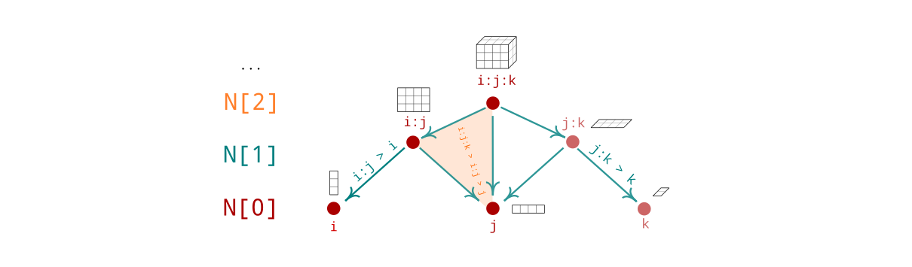

# Topos

[hypergraph]: https://en.wikipedia.org/wiki/Hypergraph
[nerve]: https://en.wikipedia.org/wiki/Nerve_(category_theory)

## Installation 

The only requirement should be pytorch: `pip install torch`.

Then clone the repository locally to start using the library. 

```
git clone https://github.com/opeltre/topos
```

## Usage 

### Systems 

System instances describe collections of variables (vertices) 
along with their allowed joint measurements (cells or regions). 
The number of states `N["i"]` for each variable `"i"` is 2 by default,
but can be supplied as a dictionnary.

A system can for example be a graph (all regions are pairs) 
or a higher dimensional instance, called a [hypergraph][hypergraph]. 
For generalized belief propagation (GBP) to run well,
the underlying hypergraph should be closed under intersection (default). 

```py
from topos import System
K = System(("i:j:k", "j:k:l", "i:k:l")), close=True)
```

When a `System` instance is created, all inclusions relations 
are computed to yield the [nerve][nerve] of the hypergraph. 



A collection of topological and combinatorial operators 
are moreover computed, acting on Field instances. 

### Fields 

A 0-Field `u` is a collection of tensors indexed by regions 
such that `u[a]` is a function on the state of 
variables in the region `a` 
(that is, a d-dimensional tensor when a is of size d)

A 1-Field `phi` is a collection of tensors indexed by 1-chains 
such that `phi[a > b]` is a function on the state of variables in `b`. 


```py
>>> u   = K[0].zeros() 
>>> phi = K[1].randn()
>>> phi["j:k > k"]
torch.tensor([-0.5114, 0.5331])
```

TODO: `__setitem__` and other initializers (dict, lambdas...)

### Operators  

There is a collection of natural operators acting on such
statistical systems, revealing a rich interplay with topology 
and combinatorics. 

These include (implemented):
- a differential operator `K.d[k]` from k-fields to (k+1)-fields
- a codifferential operator `K.delta[k+1]` from (k+1)-fields to k-fields
- the zeta transform `K.zeta[k]` acting on k-fields
- the Möbius transform `K.mu[k]` inverting `K.zeta[k]`
- the Gibbs state map `K[k].gibbs` mapping fields to local probabilities
- the effective energy gradient `K.Deff` from 0-fields to 1-fields
- its tangent map `K.nabla(p)` at a consistent belief `p`. 

## Example: belief network on graphs

See [example.py](example.py)

```py
>>> K = System(("i:j", "j:k"))

>>> u = K[0].randn()
>>> u
0 Field {

(i:j) ::       [[-1.6016,  0.6941],
                [-0.2367, -0.1504]],

(j:k) ::       [[ 0.3672, -0.0543],
                [ 0.7570, -0.0231]],

(j) ::       [0.5114, 0.5331],

}

>>> d
1 Linear d

>>> d(u)
1 Field {

(i:j) > (j) ::       [ 2.3497, -0.0106],

(j:k) > (j) ::       [ 0.1985, -0.2008],

}
``` 
<style>
img {
    width: 250px
}
</style>
